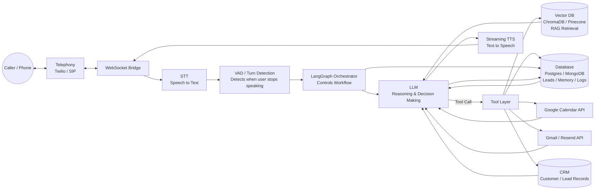

# Task 1 — Modern Voice Agent Architecture

## 1.1 Pipeline Overview

A phone-based sales agent is not a chatbot with a voice bolted on — every stage has to run in near real time and recover gracefully from noise, interruptions, and half-finished sentences. The pipeline breaks into eight stages:

| Stage | Function | Typical latency budget |
|---|---|---|
| Telephony | Receives/places the PSTN or SIP call, streams audio in both directions | — |
| Speech-to-Text (STT) | Converts caller audio to text in real time, with interim + final transcripts | 150–300 ms |
| Turn/VAD detection | Decides when the caller has actually finished speaking (voice activity detection + endpointing) | 100–200 ms |
| LLM reasoning | Interprets intent, decides what to say/do next | 300–800 ms |
| Tool calling | Executes actions (RAG lookup, calendar booking, CRM write, email send) | varies (async where possible) |
| Retrieval (RAG) | Pulls factual property/company data to ground the answer | 100–300 ms |
| Memory | Short-term (this call) + long-term (this caller, past calls) context | — |
| Text-to-Speech (TTS) | Converts the reply to natural, streamed audio | 100–300 ms to first audio byte |
| Workflow orchestration | Coordinates the above + external systems (Calendar, Email, CRM) as a stateful graph | — |

Target: **under ~1.2s from caller silence to first audio byte back**, achieved mainly by streaming every stage (streaming STT → streaming LLM tokens → streaming TTS) rather than waiting for each stage to fully finish before the next starts.

## 1.2 Component Responsibilities

- **Speech-to-Text**: Deepgram Nova (or AssemblyAI / Whisper streaming) — must handle Urdu-English code-switching mid-sentence, background noise on mobile calls, and give interim results for barge-in detection.
- **LLM reasoning**: GPT-4.x / Claude / Gemini as the "brain" — intent classification, slot filling (name, budget, area, property type, timeline), objection handling, and deciding which tool to call.
- **Tool calling**: Structured function calls exposed to the LLM — `search_properties()`, `check_availability()`, `book_visit()`, `reschedule_visit()`, `cancel_visit()`, `send_email()`, `log_conversation()`.
- **Retrieval (RAG)**: Vector DB (ChromaDB/Pinecone) indexing the property catalogue, FAQs, payment plans, society rules, legal docs — retrieved per-turn and injected into the LLM context so answers are grounded, not hallucinated.
- **Memory**: Session memory (current call transcript + extracted slots) held in-process; persistent memory (caller phone number → past inquiries, preferences, previous visits) stored in Postgres/Mongo and fetched at call start so returning callers aren't asked to repeat themselves.
- **Text-to-Speech**: Fish Audio (see Task 4) streamed sentence-by-sentence as the LLM generates tokens, not after the full reply is ready.
- **Telephony**: Twilio / SIP trunk → WebSocket bridge into the STT/LLM/TTS pipeline.
- **Workflow orchestration**: LangGraph state machine — each conversation is a graph of nodes (greet → identify intent → qualify → recommend → handle objection → book/reschedule/cancel → confirm → close) with edges chosen by the LLM's classified intent, so the conversation can jump between branches (e.g., caller suddenly asks to reschedule mid-recommendation) without breaking.

## 1.3 Architecture Diagram

