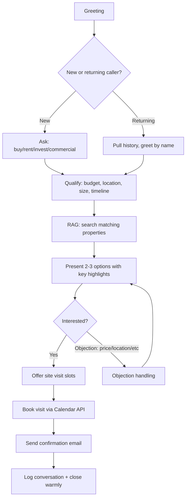
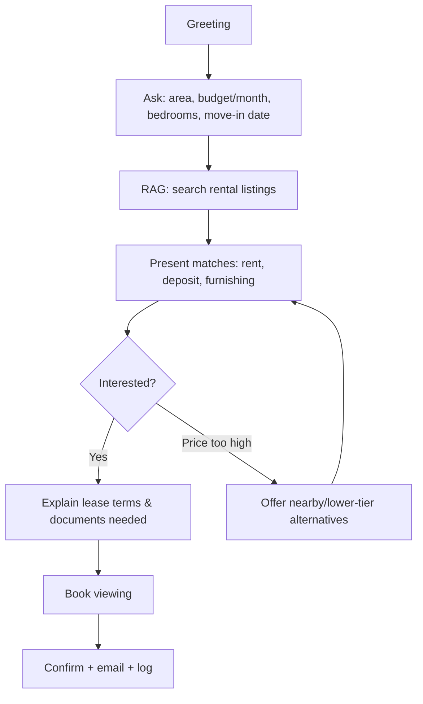
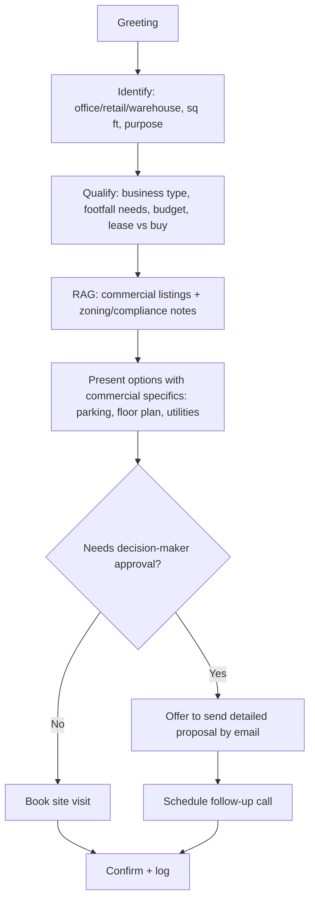
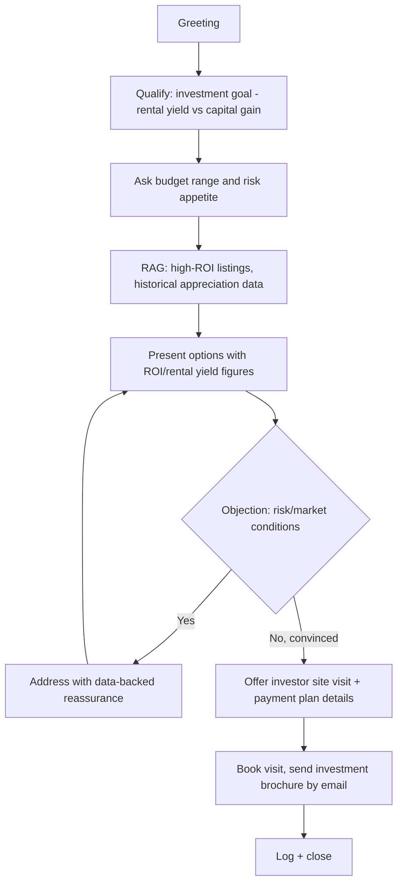
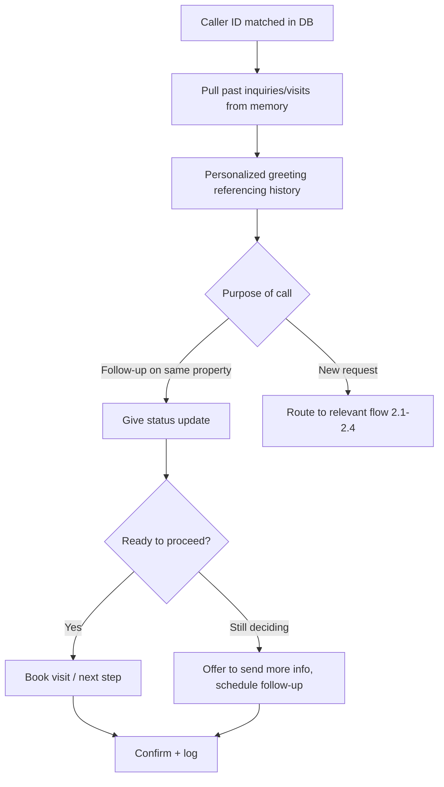
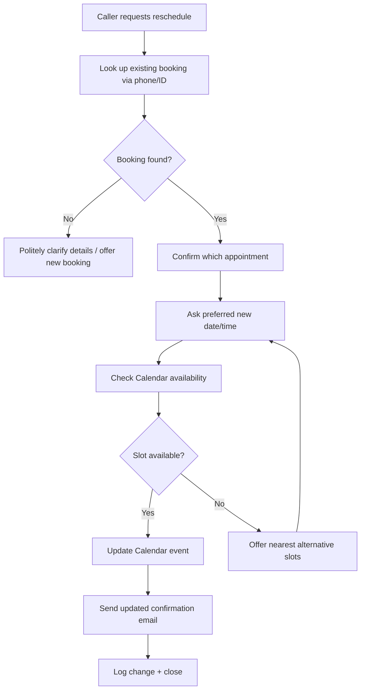
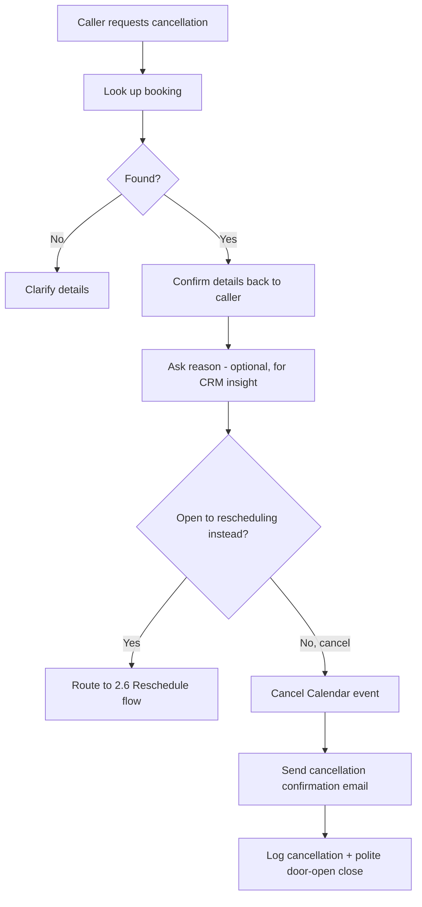

# Task 2 — Conversation Flow Design

Each flow below follows the same skeleton — **Greet → Identify Intent → Qualify → Deliver Value → Handle Objection → Drive to Action → Confirm → Close/Log** — but branches differently once intent is known.

## 2.1 Buyer Inquiry

## 2.2 Rental Inquiry

## 2.3 Commercial Property Inquiry

## 2.4 Investment Inquiry

## 2.5 Returning Customer

## 2.6 Appointment Rescheduling

## 2.7 Appointment Cancellation

