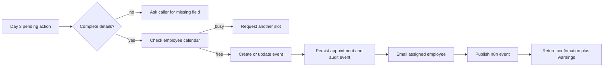

# Day 4 workflow

Reschedule and cancellation accept the internal appointment UUID. The Google
event ID is loaded from CRM so a caller cannot inject an arbitrary event ID.
Notification failures remain visible as warnings and do not create duplicate
calendar events.
